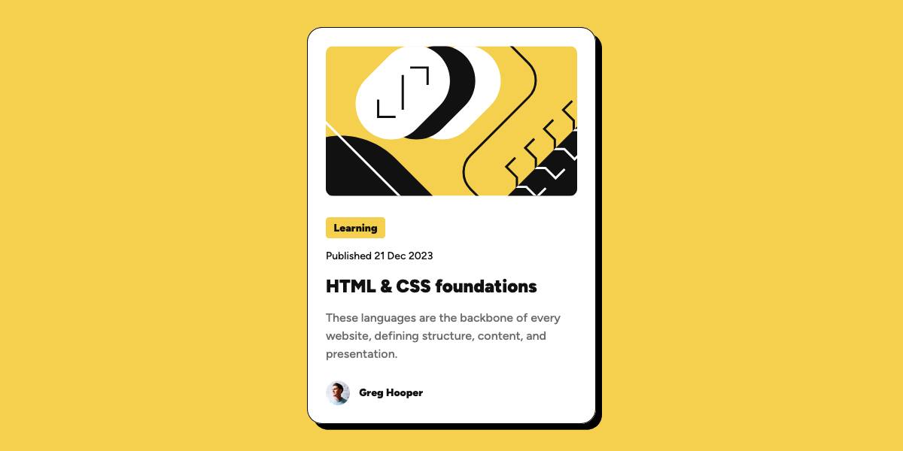

# Frontend Mentor - Blog preview card solution

Hey👋, this is my solution to the [Blog preview card challenge on Frontend Mentor](https://www.frontendmentor.io/challenges/blog-preview-card-ckPaj01IcS). I would appreciate getting feedback from you.

## Overview

### The challenge

User should be able to:

- See hover and focus states for all interactive elements on the page

### Screenshot

### Links

- Live preview here 👉 [Add live site URL here](https://rfn16zn.github.io/blog-preview-card/)

### Built with

- Semantic HTML5 markup
- CSS at-rule @font-face for variable fonts
- CSS custom properties
- CSS Flexbox
